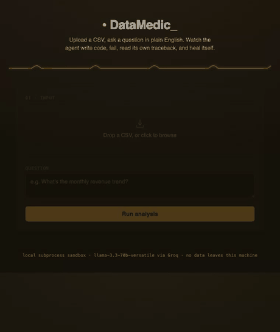
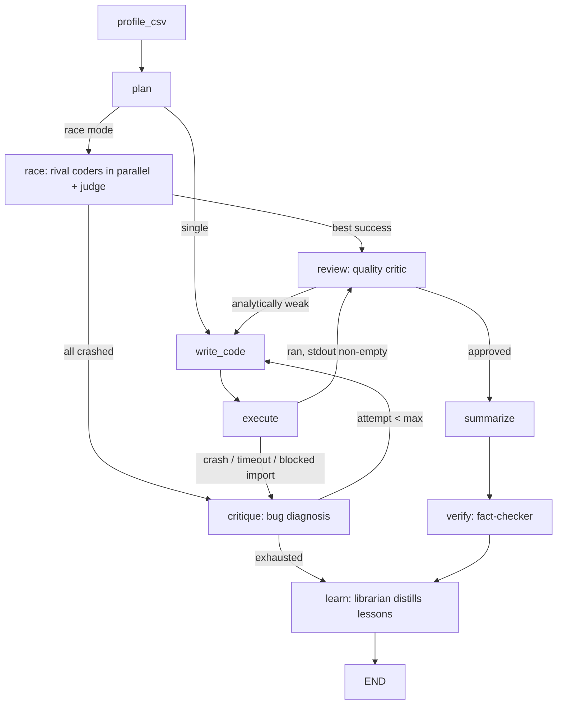

# DataMedic

Upload any CSV, ask a question in plain English — or ask nothing and let it explore. The agent writes pandas/matplotlib code, runs it in a sandbox, reads its own tracebacks when it fails, and rewrites the code until it works. You watch all of it happen **live**: the state machine animates, the code streams token-by-token, rival coders race in parallel lanes — and when a run teaches the agent something, it **remembers it for every future run**.



Built to demonstrate: agentic self-correction, multi-critic LLM pipelines, cross-run learning memory, parallel best-of-N generation with a judge, real-time agent observability (SSE token streaming), sandboxed code execution, and LangGraph state machines.

---

## The agent, at a glance



Every node is instrumented: the UI's **agent cockpit** renders this exact graph and lights up the active node in real time, while the plan, code, critiques, and summary stream token-by-token into a live terminal pane.

### The five loops that make it interesting

1. **Self-healing** — a crash goes to the `critique` node, which diagnoses the traceback ("some values are already numeric — type-check before calling `.replace`"), and the coder rewrites with that diagnosis in hand. Up to 4 attempts.
2. **Quality review** — running isn't enough. A separate critic reads the successful output and rejects analyses that don't actually answer the question ("stdout has aggregated totals but no monthly trend — redo it"). Not error recovery: *taste* enforcement.
3. **Fact-checking** — before the final summary ships, a verifier grounds every number in it against the script's real stdout. Hallucinated figures get rewritten. Verified results carry a ✓ badge.
4. **The race** (optional) — attempt 1 launches two rival coders concurrently with different style directives (vectorized vs. defensive), executes both in parallel sandboxes, and a judge LLM picks the better output. Watch them compete in the cockpit's racing lanes.
5. **Learning memory** — after any run with crashes (healed *or* exhausted), a librarian LLM distills each failure into a generalized lesson with trigger keywords, stored in `lessons.json`. Future runs on similar-looking data get matching lessons injected into the coder's first prompt — the agent visibly gets smarter with use (`📚 applied 1 learned lesson`).

## What a run looks like

Uploading messy sales data (currency strings like `"$1,234.56"`, three date formats, nulls) with *"What's the monthly sales trend?"*, one real run went:

- **Attempt 1 crashed** — `AttributeError: 'float' object has no attribute 'replace'`; the critique named the exact fix.
- **Attempt 2 ran — and the reviewer sent it back**: *"stdout does not provide a clear monthly sales trend, only aggregated metrics."*
- **Attempt 3 shipped** — annotated line chart with the peak labeled, stat cards ($314,406 total, October 2024 peak), a fact-checked summary, and a distilled lesson stored for next time.

## Features

- **Live agent cockpit** — animated state machine + token-streaming terminal, powered by SSE (`/events/{job_id}`). No polling theater; you see the model think.
- **Race mode** — parallel rival coders + judge, rendered as live racing lanes.
- **Cross-run memory** — lessons distilled from failures, retrieved by profile-matching triggers, injected into future prompts. Runs that fail completely still teach the agent.
- **Stat cards + multi-chart dashboards** — a structured `METRICS_JSON` contract turns key figures into cards; up to 4 annotated charts per question.
- **Auto-EDA** — empty question = the agent picks the most interesting analyses itself.
- **Suggested questions** — drop a CSV, get 3 clickable question chips generated from its actual columns.
- **One-click report** — any finished run exports as a single self-contained HTML file (charts inlined as base64): question, stat cards, narrative interleaved with charts, the fact-check badge, and the full fail→heal history.
- **Fact-checked summaries** — ✓ badge means every number was cross-checked against the script's stdout.

## Quickstart

```bash
uv sync
cp .env.example .env   # then set GROQ_API_KEY=...
uv run uvicorn app.main:app --reload
```

Open `http://localhost:8000`, drag in a CSV from `examples/`, and ask a question — or leave it empty and hit Run. Toggle ⚡ race mode for the rival-coder show.

Model defaults to `llama-3.3-70b-versatile`; override with `DATAMEDIC_MODEL` (e.g. `llama-3.1-8b-instant` if you exhaust the 70B daily free-tier quota).

## Tests

```bash
uv run pytest
```

The graph tests run the *entire* agent loop offline — LLM calls are scripted, code execution is real — covering crash→heal, review→revise, the parallel race (wins and total wipeouts), blocked-import recovery, hallucination correction, lesson distillation/injection, attempt exhaustion, and auto-EDA routing.

## Architecture notes

- `app/graph.py` — LangGraph state machine; every node wrapped with event instrumentation.
- `app/nodes.py` — node implementations; `_ask` streams tokens to the event bus and survives rate limits with backoff; `_ask_json` re-asks when a model returns malformed JSON.
- `app/events.py` — per-job append-only event log; SSE endpoint replays then follows.
- `app/memory.py` — lesson store with trigger-keyword retrieval and recency fallback.
- `app/sandbox.py` — static import blocklist + subprocess isolation (fresh temp dir, 30s timeout); the CSV is copied into the sandbox as `data.csv` so the model never transcribes long paths.
- `app/report.py` — standalone HTML report builder.

## Known limitations

- **In-memory job store.** Job state and event logs live in process-local dicts — a restart loses them. Fine for a demo, not production.
- **Subprocess sandbox, not a security boundary.** Static blocklist + timeout + temp dir ≠ container/VM isolation. Don't expose it to untrusted multi-tenant traffic.
- **Single user.** No auth; any client can read any job by id.
- **Groq free tier.** The 70B model has a daily token cap; heavy sessions need `DATAMEDIC_MODEL=llama-3.1-8b-instant` or a paid tier.

## Non-goals

Auth, multi-user persistence, Docker, a database, deployment configs, chart-type selection UI, multi-file uploads.
