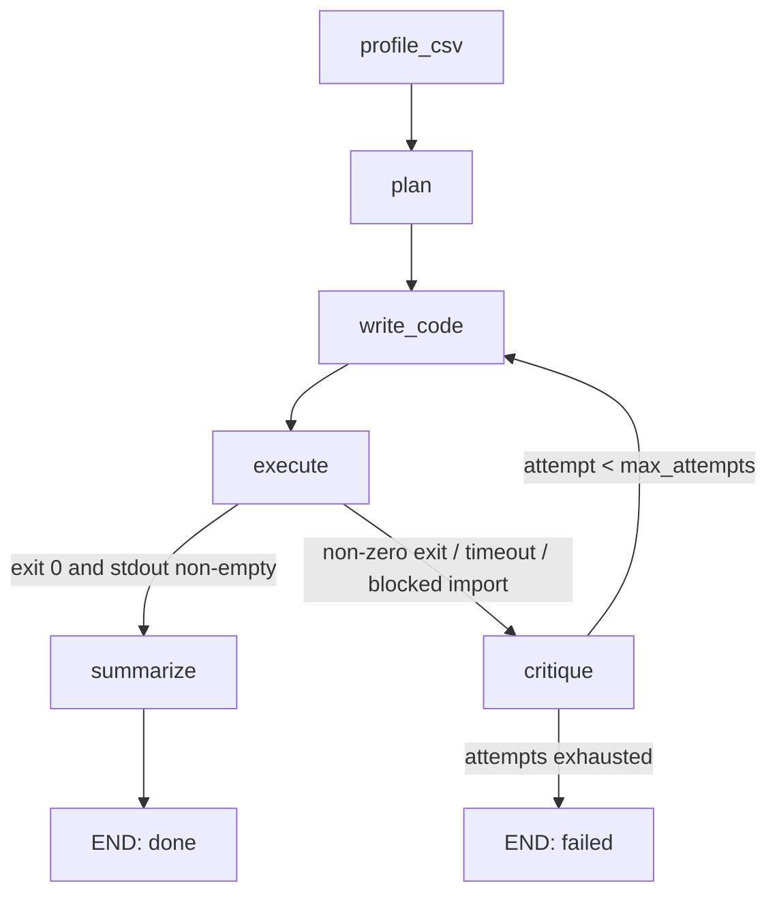

# DataMedic

Upload any CSV, ask a question in plain English. The agent writes pandas/matplotlib code, runs it in a sandbox, reads its own tracebacks when it fails, and rewrites the code until it works — then returns the chart plus a written insight.


Built to demonstrate: agentic self-correction loops, sandboxed code execution, structured LLM output, and LangGraph state machines.

---

## Architecture



- **profile_csv** (deterministic) — loads the CSV with pandas, produces a profile: shape, dtypes, null counts, and 5 sample rows.
- **plan** (LLM) — turns the profile + question into a short natural-language analysis plan.
- **write_code** (LLM) — writes a complete standalone Python script. On retry, it also receives the previous code, the stderr, and the critique.
- **execute** (deterministic) — statically rejects unsafe code, then runs the script as a subprocess in a fresh temp dir with a 30s timeout, capturing stdout/stderr and checking whether a chart PNG was produced.
- **critique** (LLM, on failure) — diagnoses the bug from the traceback and states a fix strategy. The attempt (code, stderr, critique) is appended to `history`.
- **summarize** (LLM, on success) — turns the script's stdout into a plain-English insight that references the actual numbers.

## How self-healing works

Uploading `examples/sales.csv` (synthetic sales data with mixed date formats, a `unit_price` column formatted as `"$1,234.56"` strings, and nulls) with the question **"What's the monthly revenue trend?"** produces exactly this sequence on a real run:

**Attempt 1 fails** — the agent's first script grouped revenue by month using `.dt.to_period('M')`, which seaborn's `lineplot` can't plot directly:

```
Traceback (most recent call last):
  File "pandas/_libs/lib.pyx", line 2478, in pandas._libs.lib.maybe_convert_numeric
TypeError: Invalid object type
...
TypeError: float() argument must be a string or a real number, not 'Period'
```

**Critique** (generated from that traceback):

> The bug is caused by the 'month' column in the `monthly_revenue` DataFrame being of type `Period` instead of a numeric or datetime type that can be plotted by seaborn. To fix this, convert the 'month' column to a datetime or string type before plotting — for example using `dt.to_timestamp()` or `dt.strftime('%Y-%m')`.

**Attempt 2 succeeds** — the rewritten script converts `month` to a string with `dt.strftime('%Y-%m')` before grouping and plotting, prints the monthly totals, and saves a line chart. `summarize` then produces the final written insight, referencing real numbers from stdout (e.g. "highest revenue was in January 2025, at $69,165.70").

The UI's status panel shows every attempt as a card — collapsed code, red stderr snippet, and the critique line — so this loop is visible live, not just in the final result.

A blocked import (e.g. the model generates `import os`) is caught by the same path: `sandbox.py` statically rejects it before the subprocess ever runs, synthesizes a `"blocked import: os"` stderr, and routes straight to `critique`, which recovers on the next attempt.

## Quickstart

```bash
uv sync
cp .env.example .env   # then set GROQ_API_KEY=...
uv run uvicorn app.main:app --reload
```

Open `http://localhost:8000`, drag in a CSV from `examples/`, and ask a question.

## Tests

```bash
uv run pytest
```

## Known limitations

- **In-memory job store.** Job state lives in a process-local dict (`app/main.py`) — restarting the server loses all job history and results. Fine for a demo, not for production.
- **Subprocess sandbox, not a real sandbox.** Generated code is statically checked against a blocklist and run with a timeout in a temp directory, but this is not a security boundary equivalent to a container or VM. Don't point it at untrusted multi-tenant traffic.
- **Single user.** No auth, no per-user isolation — anyone hitting the API can submit jobs and read any job's result by `job_id`.

## Non-goals

Auth, multi-user persistence, Docker, a database, deployment configs, chart-type selection UI, multi-file uploads.
