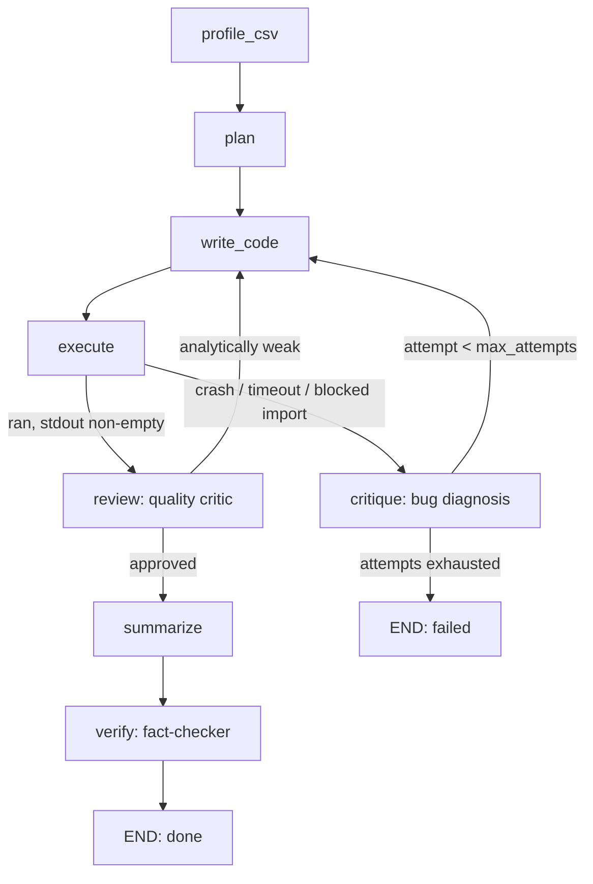

# DataMedic

Upload any CSV, ask a question in plain English — or ask nothing and let it explore. The agent writes pandas/matplotlib code, runs it in a sandbox, reads its own tracebacks when it fails, and rewrites the code until it works. A second critic reviews *working* output for analytical quality, and a fact-checker verifies every number in the final write-up against the script's actual stdout.


Built to demonstrate: agentic self-correction loops, multi-critic LLM pipelines, sandboxed code execution, structured LLM output, and LangGraph state machines.

---

## Architecture



- **profile_csv** (deterministic) — loads the CSV with pandas, produces a profile: shape, dtypes, null counts, and 5 sample rows.
- **plan** (LLM) — turns the profile + question into a short analysis plan. With an **empty question it switches to auto-EDA mode**: the model picks the 2–3 most interesting analyses itself.
- **write_code** (LLM) — writes a complete standalone Python script producing 1–4 annotated charts and a structured `METRICS_JSON` line of key figures. On retry it also receives the previous code, the stderr, and the critique.
- **execute** (deterministic) — statically rejects unsafe code, copies the CSV into a fresh sandbox dir as `data.csv` (the model never transcribes long temp paths), runs the script as a subprocess with a 30s timeout, and persists every `chart_*.png` produced.
- **review** (LLM, on success) — a quality critic distinct from error handling: the script *ran*, but does the output actually answer the question, with real numbers and the planned charts? Weak analyses are sent back to `write_code` with specific feedback (bounded by a revision budget).
- **critique** (LLM, on failure) — diagnoses the bug from the traceback and states a fix strategy. Every rejected attempt (crash or review) is appended to `history` and shown in the UI.
- **summarize** (LLM, on approval) — turns the script's stdout into a plain-English insight referencing the actual numbers.
- **verify** (LLM, last) — cross-checks every figure in the summary against the stdout; hallucinated numbers get the summary rewritten from ground truth. Verified results carry a badge in the UI.

## How self-healing works

Uploading `examples/sales.csv` (synthetic sales data with mixed date formats, a `unit_price` column formatted as `"$1,234.56"` strings, and nulls) with **"What's the monthly sales trend?"** produced exactly this sequence on a real run:

**Attempt 1 crashes** — the cleaning helper assumed every price was a string:

```
File ".../analysis.py", line 35, in <module>
    df['unit_price'] = df['unit_price'].apply(parse_unit_price)
AttributeError: 'float' object has no attribute 'replace'
```

**Critique:** *"Some values in the 'unit_price' column are already numeric. Add a type check in `parse_unit_price` to only attempt to replace characters if the input is a string."*

**Attempt 2 runs — and gets sent back by the reviewer.** The script executed cleanly, but the quality critic rejected it: *"The analysis plan called for 1 line chart to visualize the monthly sales trend, but 2 charts were produced, and the stdout does not provide a clear monthly sales trend, only aggregated metrics."* This is the second loop: not error recovery, quality control.

**Attempt 3 succeeds** — monthly aggregation, one annotated line chart with the peak labeled, a `METRICS_JSON` line that becomes stat cards ($314,406 total, $20,960/month average, October 2024 peak), and a summary whose numbers are then fact-checked against stdout before it ships.

A blocked import (e.g. the model generates `import os`) is caught by the same path: `sandbox.py` statically rejects it before the subprocess ever runs, synthesizes a `"blocked import: os"` stderr, and routes to `critique`, which recovers on the next attempt.

## Features

- **Self-healing retry loop** — crashes are diagnosed and fixed automatically, every attempt visible in the UI as it happens.
- **Quality-review loop** — a second critic rejects analyses that run but don't answer the question.
- **Fact-checked summaries** — a verifier grounds every number in the script's real output; verified results carry a ✓ badge.
- **Stat cards + multi-chart dashboards** — structured key metrics and up to 4 annotated charts per question.
- **Auto-EDA** — submit with an empty question and the agent picks the most interesting analyses itself.
- **Suggested questions** — drop a CSV and get 3 clickable question chips generated from its actual columns.

## Quickstart

```bash
uv sync
cp .env.example .env   # then set GROQ_API_KEY=...
uv run uvicorn app.main:app --reload
```

Open `http://localhost:8000`, drag in a CSV from `examples/`, and ask a question — or leave it empty and hit Run.

## Tests

```bash
uv run pytest
```

The graph tests run the *entire* agent loop offline — LLM calls are scripted, code execution is real — covering crash→heal, review→revise, blocked-import recovery, hallucination correction, attempt exhaustion, and auto-EDA routing.

## Known limitations

- **In-memory job store.** Job state lives in a process-local dict (`app/main.py`) — restarting the server loses all job history and results. Fine for a demo, not for production.
- **Subprocess sandbox, not a real sandbox.** Generated code is statically checked against a blocklist and run with a timeout in a temp directory, but this is not a security boundary equivalent to a container or VM. Don't point it at untrusted multi-tenant traffic.
- **Single user.** No auth, no per-user isolation — anyone hitting the API can submit jobs and read any job's result by `job_id`.

## Non-goals

Auth, multi-user persistence, Docker, a database, deployment configs, chart-type selection UI, multi-file uploads.
